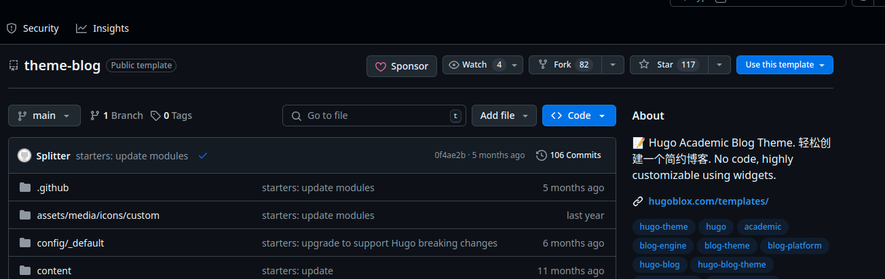



## Introduction

Blogdown is a package for R that makes it easy to create and manage static websites using the Hugo framework.
This guide will walk you through the process of setting up a Blogdown site, customizing it, and deploying it to a web server.

Oh rather, this is what I did to make it work for me.

## Requirements

I wanted a simple blog with a few features, that did the following:

- Easily create new posts, combining text, code and images
- Easily deploy to a local webserver
- Pages created in code that are version controled in github 
- Executes **R** and **Python** code 
- Use a clean theme that is __easy__ to customize
- Scriptable, at least managed with `Makefile rules`
- Doesn't require website knowledge, like CSS etc.
- Fits inside VS Code, with handy previews and local development services

So this all fits with Blogdown, and Hugo themes that can be downloaded and installed with a few clicks.

## Headlines

It didn't quite work out of the box, and customization is not so straightforward.
Here are my learnings, and the things I needed to tweak to get it working.

## Installation, configuration and first posts

The basic order of things is as follows, later I'll go into detail on each step.

1. Fork the github project of the theme you want to use
2. Clone your newly forked Hugo theme
3. Set up a python virtual environment
4. Set up a R virtual environment
5. Set up VS Code to work with the virtual environments
6. Install `Blogdown`, `reticulate` and several other helper packages
7. Install all the usual R and Python packages you need for standard data science stuff 
8. Customize the theme and site configurations, setting up how I wanted the site to look and feel.
9. Create automation scripts for cleaning up site files, building and deploying packages
10. Start creating content!

Let's get to the details.

## 1. Fork the theme

I based my blogsite off [The Creator's Blog Theme](https://github.com/HugoBlox/theme-blog)
that advertises itself as "Hugo Academic Blog Theme". There was no particular reason for 
using this theme, save it was the first one I found that looked good and had a few features I wanted.

Using the theme was as simple as clicking the `Use this template` button on the GitHub page.

<div style="float: left; margin-right: 15px;">
  
</div>

Using the theme was as simple as clicking the `Use this template` button on the GitHub page.

<div style="clear: both;"></div>

## 2. Cloning the new blog

I called the new repository `blogsite`, and cloned it to my local machine.

```{bash, eval=FALSE}
$ cd Code
$ git clone git@github.com:ian1roberts/blogsite.git
$ cd blogsite
$ ls

assets  config  content  go.mod  go.sum  hugoblox.yaml  hugo_stats.json
index.Rmd  layouts  LICENSE.md  Makefile  notebooks  public  README.md
resources  static  themes
```

## 3. Set up a python virtual environment

The majority of experiments I'll be exploring on my blogsite will be Python based. However, 
`blogdown` is a R package, and I wanted to use R for the blog posts. As a workaround, R can fully execute 
Python code via the `reticulate` package. Moreover, it can do so using a python virtual environment.

Python interpreters are managed by `pyenv` on my machine. 

```{bash, eval=FALSE}
$ pyenv which python
/home/ian/.pyenv/versions/3.11.8/bin/python
```
I created a new virtual environment for the blogsite, and installed the packages I needed.

```{bash, eval=FALSE}
$ python -m virtualenv .env 
$ source .env/bin/activate
$ python -m pip install --upgrade pip
```
Later we'll come back and install a ton of programming and data science packages

## 4. Set up a R virtual environment

R doesn't have such an established virtual environment system as Python, but it does have a few options.
I use `renv` to manage R packages, and it works well for me.
```{r, eval=FALSE}
library(renv)
renv::init()
# Need to close terminal and restart R session for this to work
# Comeback and install the packages you need
renv::install(c("rlang", "jsonlite", "languageserver",
"blogdown", "reticulate", "rmarkdown", "knitr"))
```

## 5. Set up VS Code to work with the virtual environments
VS Code is a great IDE for R and Python, and it works well with virtual environments.

There are 3 main customizations I made to get it working:
1. Configure the vsc-R plugin that provides VS Code with R support. This will not work out of the box.
2. Create an `.Rprofile` start up file that sets options for `Blogdown`.
3. Configure `reticulate` to set the default python interpreter to the virtual environment we created above. 

### 5.1 Configure the vsc-R plugin

After installing the vsc-R plugin via the VS Code Extensions store (search reditorsupport.r
), I had to set up a few options to get it working.  Notably, the extension creates a .vscode-R directory 
in the home directory, and creates files called `settings.json` and `init.R` in that directory that needs modifying.

Settings can be made using the in built GUI, or by editing the `settings.json` file directly.
However, I found they didn't always persist after restarting VS Code, so I edited the file directly.

Changes to make:
* Path to R interpreter --> `"linux":"/usr/bin/R"`
* Path to R user library --> test with `.libPaths()`

Essentially, if your user library is not set up, you'll not be able 
to install packages, and necessary libraries will not be found.


Only R terminal sessions generated from the Terminal menu in VS Code will have the correct settings.
Starting an R session from a BASH terminal will not have the correct environment


### 5.2 Create an `.Rprofile` start up file

The `.Rprofile` file is a special file that R looks for when it starts up.
Here we set default options for `Blogdown`, and set up a custom function to create new posts.

I'm also globally suppressing warnings and messages from knitr chunks, and setting the default chunk options.

Note that we also force the `vscode-R` plugin to attach to the R session when it starts up.

```{r, eval=FALSE}
options(blogdown.hugo.version = "0.145.0")
options(blogdown.verbose = TRUE)
options(
  blogdown.ext = ".Rmd",
  blogdown.author = "Ian Roberts",
  blogdown.subdir = "blog",
  blogdown.method = "markdown"
)

blogit <- function(title = "Untitled",
                   tags = c("R", "blogdown"),
                   categories = c("Programming", "R")) {
  blogdown::new_post(
    title = title,
    kind = "Rmd",
    open = FALSE,
    tags = tags,
    categories = categories
  )
}

if (interactive() && Sys.getenv("TERM_PROGRAM") == "vscode") {
  if (requireNamespace("vscode-R", quietly = TRUE)) {
    vscode - R:::.vsc.attach()
    options(vsc.rmarkdown.filetypes = c(".Rmd"))
  }
}

# Default knitr chunk options
options(knitr.default.chunk = list(
  echo = TRUE,
  warning = FALSE,
  message = FALSE
))
```
This file is located in the root of the blogsite directory, and is loaded when R starts up.

### 5.3 Configure `reticulate` to set the default python interpreter

The `reticulate` package is used to interface between R and Python.
It can be configured to use the virtual environment we created above.
This way we can install python packages in the virtual environment, and use them in R.

```{r setup-reticulate, eval=TRUE}
tryCatch(
  {
    source(".Rprofile")
  },
  error = function(e) {
    message("Could not source .Rprofile: ", e$message)
    print(getwd())
    Sys.setenv(RETICULATE_PYTHON_ENV = paste0(getwd(), "/../../../.env/"))
  }
)
library(reticulate)
py_config()
```

Here's a bit of Python code that I use to test the virtual environment is working.

```{python, eval=TRUE}
a = 1
b = 2
c = a + b
print(c)

# and a plot
import matplotlib.pyplot as plt

# Data for the plot
x = [1, 2, 3, 4, 5]
y = [1, 4, 9, 16, 25]

# Create the plot
plt.plot(x, y, marker='o', linestyle='-', color='b', label='y = x^2')

# Add labels and title
plt.xlabel('X-axis')
plt.ylabel('Y-axis')
plt.title('Simple Line Plot')

# Add a legend
plt.legend()

plt.savefig("plot.png")  # Save the plot as a PNG file
plt.close()
```


## 6 & 7. Install `Blogdown`, `reticulate` and several other helper packages

Goes without saying, but you need to install the `Blogdown` package
I also took this opportunity to install multiple other packages I use for data science, and
programming in R.  Especially `tidyverse`, and that wasn't straightforward as it requires 
a lot of dependencies that must be installed in the linux system.

Here are the linux packages I installed to get it working.
```{bash, eval=FALSE}
$ sudo apt update
$ sudo apt install -y build-essential libcurl4-openssl-dev libssl-dev libxml2-dev \
                      libharfbuzz-dev libfreetype6-dev libfribidi-dev \
                      libpng-dev libjpeg-dev libtiff-dev zlib1g-dev  \
                      pandoc pandoc-citeproc
```

Afterwards, I installed the packages I needed in R.
```{r, eval=FALSE}
library(renv)
renv::install(c("rlang", "jsonlite", "languageserver",
"blogdown", "reticulate", "rmarkdown", "knitr"))
renv::install(c("tidyverse", "ggplot2", "gganimate", "plotly", "shiny"))
renv::install(c("rmarkdown", "bookdown", "blogdown", "reticulate"))
``` 

For python, I activated the virtual environment and installed the packages I needed.
```{bash, eval=FALSE}
$ source .env/bin/activate
$ python -m pip install --upgrade pip
$ pip install ipython jupyter black flake8 pylint mypy isort
$ pip install numpy pandas matplotlib seaborn scipy scikit-learn statsmodels
$ pip install jupyterlab notebook
$ pip install plotly bokeh altair
$ pip install tensorflow keras torch torchvision torchaudio
$ pip install docker-compose docker
$ pip install pytest pytest-cov tox
```

While `poetry` isn't being used to manage the virtual environment, it is installed and can be used to manage packages.
```{bash, eval=FALSE}
$ pip install poetry
```
## 8. Customize the theme and site configurations

Next came the most difficult bits of the set up process, mostly because I didn't know what I was doing.

The default [Hugo Tailwind](https://themes.gohugo.io/themes/blox-tailwind/) theme contains a lot of components and
imagery I didn't want, and removing them was a bit of a pain.
Essentially, Hugo themes are installed in your home directoy under `~/.cache/hugo_cache` and modifying them requires 
overriding the component of interest by creating a new file in the `layouts` directory of your blogsite.

```{bash, eval=FALSE}
# The actual install path for me is:
/home/ian/.cache/hugo_cache/modules/filecache/modules/\
  pkg/mod/github.com/!hugo!blox/hugo-blox-builder\
  /modules/blox-tailwind@v0.3.1
  
# I created a `zz_layout` symlink to the theme in the blogsite directory
$ cd blogsite
$ ls zzz_layouts
assets  go.mod     i18n    layouts       pnpm-lock.yaml     README.md           theme.toml
data    hugo.yaml  images  package.json  postcss.config.js  tailwind.config.js  vite.config.js
```

The changes I made to way the theme works are as follows:

- Removed the `hero` image and text from the home page
- Removed the `edit page in github` link from all table of contents
- Fixed an issue where if pages don't have headers, the table of contents would crash
- Removed socials and share icons from the footer of all pages
- Added a default featured image to all posts so that the blog index page has a consisten look

Logic for themes ... 

Blog posts are made using a templating system, and the default template is `single.html` located 
in the `layouts/_default` directory. Modifying sections in the template will apply changes 
to all posts. The template is applied in 3 steps:

1. Each blog post `index.Rmd` file is converted to a markdown file using the `blogdown::build_site()` function.
2. The markdown file is then converted to HTML using `hugo build` that ultimately creates HTML from markdown
3. The HTML file is then rendered using the `single.html` template.

In reality `blogdown::build_site()` is a wrapper for `hugo build`, with the only difference being that 
`blogdown::build_site()` will also build the Rmd files in the `content` directory, excuting R code chunks
using `knitr` and `rmarkdown`.  By default blogdown front-matter sets output to markdown ensuring that executable code chunks 
are preprocessed before the markdown is passed to `hugo build`.  This means that blogdown posts `*.Rmd`
benefit from all the coding features of `knitr::rmarkdown`, and styling and theming capabilities of `Hugo`.

Note that this is a complex process, and took a long time to figure out. The process steps and order 
are entirely determined by file extensions of the blog posts, and `*.Rmarkdown`, `*.markdown` and `*.md` files are all
processed in different ways.  Markdown files are rendered directly by `hugo build`. Shortcodes are processed, but no code chunks.

`*.Rmarkdown` files are processed by `blogdown::build_site()`, but pages cannot be previewed in 
VS Code, as `.vsc-R` does not support Rmarkdown files.

Broadly, I made 2 changes.

1. Fixed some broken behaviours in the theme
2. Modified the theme to suit my needs

### 8.1 Fixing broken behaviours

When pages were created without headers, the table of contents would crash.
I added a check to `single.html` for the presence of `.Fragments.Headings` and 
only rendered the table of contents if it was present.

You can see the changes in a `diff` 
```{bash, eval=FALSE}
diff layouts/_default/single.html zzz_layouts/layouts/_default/single.html 
14d13
< {{ if and .Fragments .Fragments.Headings }}
16d14
< {{ end }}
```

A similar check had to be made in the sidebar.html as this template is responsible 
for rendering the table of contents.

```{bash, eval=FALSE}
$ diff layouts/partials/components/sidebar.html \
  zzz_layouts/layouts/partials/components/sidebar.html

95,109c95,107
<   {{ with $page.Fragments }}
<     {{ with .Headings }}
<       <ul class="hb-sidebar-mobile-toc">
<         {{- range . }}
<           {{- with .Headings }}
<             {{- range . -}}
<               <li>
<                 <a
<                   href="#{{ anchorize .ID }}"
<                   class="hb-docs-link"
<                 >
<                   {{- .Title -}}
<                 </a>
<               </li>
<             {{ end -}}
---
>   {{ with $page.Fragments.Headings }}
>     <ul class="hb-sidebar-mobile-toc">
>       {{- range . }}
>         {{- with .Headings }}
>           {{- range . -}}
>             <li>
>               <a
>                 href="#{{ anchorize .ID }}"
>                 class="hb-docs-link"
>               >
>                 {{- .Title -}}
>               </a>
>             </li>
112,117c110,111
<       </ul>
<     {{ else }}
<       <p>No table of contents available.</p>
<     {{ end }}
<   {{ else }}
<     <p>No table of contents available.</p>
---
>       {{ end -}}
>     </ul>
```

When pages have no headers, the page shows no table of contents available


There was a github icon missing. I added this in `assets/media/hero/github.svg`.

### 8.2 Modifying the theme to suit my needs

I wanted to remove the sharing and socials icons from the footer of all pages.

This required modifying the components `page_sharer.html` and `sidebar.html` in the `layouts/partials` directory.
For socials icons, this required added a new `param` to the `params.toml` called `share` and checking if 
this was set to `false` in the template.
```{bash, eval=FALSE}
$ diff layouts/partials/components/page_sharer.html \
    zzz_layouts/layouts/partials/components/page_sharer.html 
1c1
< {{ if site.Params.share | default true }}
---
> {{ if ne .Params.share false }}
```

One of the biggest bug bears with the theme was __broken links__. The handling of page links, especially 
links to embedded images, such as those created by embedded code, or temporary rendered pages 
using `blogdown::serve_site()` was a pain.

The fix was to force the use of relative links in the `hugo.yaml` file.
```{bash, eval=FALSE}
relativeURLs: true
canonifyURLs: false
```

And then to modify the `blogdown\posteref.html` shortcode.

This sets default URL rendering to be relative.

```{bash, eval=FALSE}
{{ if eq (getenv "HUGO_BLOGDOWN_POST_RELREF") "true" }}
  {{ .Page.RelPermalink }}
{{ else }}
  {{ .Page.Permalink }}
{{ end }}
```

One nice thing about doing this, it means we can render pages in 
different ways, and page links will still work.

### 8.3 Adding a default featured image to all posts

The final change I made was to include a default featured image in all posts that didn't have one.

Hugo will look for a `featured.png` file in the post directory and display it at the top of posts.
It will also use the featured image as a thumbnail in the blog index page.

If posts don't have a featured image, the blog index page will look odd. So rendering a featured image
is one way to make the index page look more consistent.

To achieve this effect, I modified the `partials/functions/get_featured_image.html` file in the `layouts/partials` directory.

The change is a bit more complex, but essentially it checks if the post has a featured image, and if not,
it uses a default image from `assets/images/defaults/featured.png`.

## 9. Create automation scripts for cleaning up site files, building and deploying packages

I added a `Makefile` to the root of the blogsite directory that contains a few rules for cleaning up files,
building the site and deploying it to a web server.

These are the typical functions I use:

1. `make full-install` - cleans up all previous files, builds everything and deploys to the web server
2. `make update` - renders the new pages, builds the site and deploys to the web server
3. `make new-post` - creates a new post using the `blogit` function
4. `make build && make serve` - builds the site and serves it locally

The last rule creates a local web server that can be accessed via `localhost:4321` in the browser.
Note that if you are editing live, then to see the changes in the browser, you need to delete the interim `markdown files`

Finally, the inbuilt `blogdown::serve_site()` will execute embedded code chunks, and render the pages locally, but it won't 
render `hugo shortcodes`.  To allow for reloading, it reads the HTML directly from blog post working directories. This can give 
a different experience than from a fully built site in `public/` directory.

An alternative is to use `blogdown::build_site(build_rmd=TRUE)` which will render the pages using `knitr::rmarkdown` and then `hugo` and 
so correctly interpet shortcodes, depositing the final HTML in the `public/` directory.  This directory can be served using python 

```{bash, eval=FALSE}
python -m http.server --directory ./public/ 8000
```
This will serve the files in the `public/` directory on port 8000, and can be accessed via `localhost:8000` in the browser.

Meaning that you don't have to copy everything over to the web server to monitor changes.

## 10. Start creating content!

The final step is to start creating content. And that's where we are ... 

